# K3s Development Environment

[](https://kubernetes.io/)
[](https://k3s.io/)
[](https://docker.com/)
[](https://traefik.io/)
[](https://argoproj.github.io/cd/)
[](https://grafana.com/)
[](https://prometheus.io/)

[](https://opensource.org/licenses/MIT)
[](https://github.com/BrewertonSantos/k3s-dev-environment)
[](https://conventionalcommits.org)
[](https://nvie.com/posts/a-successful-git-branching-model/)
[](https://github.com/pre-commit/pre-commit)

A **production-ready development environment** using **Kubernetes (K3s)** with comprehensive observability stack. Features complete database monitoring, metrics collection, log analytics, and GitOps deployment automation.

## 🎯 Quick Access Dashboard

| Service | URL | Purpose | Status |
|---------|-----|---------|--------|
| **Grafana** | http://grafana.localhost | Monitoring & Dashboards | ✅ Complete Database Monitoring |
| **Prometheus** | http://prometheus.localhost | Metrics Collection | ✅ 30+ Metrics Available |
| **AlertManager** | http://alertmanager.localhost | Alert Management | ✅ Database & System Alerts |
| **OpenSearch** | http://opensearch.localhost | Log Analytics | ✅ Centralized Logging |
| **OpenSearch Dashboards** | http://opensearch-dashboards.localhost | Log Visualization | ✅ Kibana-compatible |
| **CloudBeaver** | http://cloudbeaver.localhost | Database Management | ✅ PostgreSQL & MySQL |

## 📊 Observability Features

- **🔍 Complete Database Monitoring**: PostgreSQL & MySQL exporters with 30+ metrics
- **📈 Real-time Dashboards**: Pre-built Grafana dashboards for databases and Kubernetes
- **🚨 Intelligent Alerting**: Automated alerts for performance thresholds and failures
- **📋 Centralized Logging**: OpenSearch with full-text search and analytics
- **🎯 Multiple Data Sources**: Prometheus, direct database access, and log correlation

## 🚀 Quick Start

```bash
# Start the complete K3s environment
./scripts/k3s-dev-env.sh start

# View service status and access URLs
./scripts/show-services.sh

# Stop the environment
./scripts/k3s-dev-env.sh stop
```

## 📋 Included Services

| Service | Namespace | Primary URL | Alt Access | Credentials |
|---------|-----------|-------------|------------|-------------|
| **Traefik** (Ingress Controller) | traefik-system | http://traefik.localhost | http://localhost:8888 | - |
| **Grafana** (Dashboards) | development | http://grafana.localhost | http://localhost:3000 | admin/admin123 |
| **Prometheus** (Monitoring) | development | http://prometheus.localhost | http://localhost:9090 | - |
| **Jaeger** (Tracing) | development | http://jaeger.localhost | http://localhost:16686 | - |
| **MinIO Console** (Storage UI) | development | http://minio.localhost | http://localhost:9001 | minioadmin/minioadmin123 |
| **MinIO API** (S3 API) | development | http://minio-api.localhost | http://localhost:9000 | - |
| **Rancher** (K8s Management) | cattle-system | http://rancher.localhost | https://localhost:8443 | admin/admin123 |
| **ArgoCD** (GitOps) | argocd | http://argocd.localhost | http://localhost:8080 | admin/admin123 |
| **PostgreSQL** (Database) | development | localhost:5432 | - | admin/admin123 |
| **Redis** (Cache) | development | localhost:6379 | - | - |

## 🌐 Service Access Methods

### Method 1: Domain Access (Recommended)
```bash
# Setup domain resolution
./scripts/setup-hosts.sh

# Access services via .localhost domains
# All URLs are listed in the table above
```

### Method 2: Port Forwarding (Fallback)
```bash
# Setup port forwarding
./scripts/setup-port-forwards.sh

# Access services via localhost ports
# Alternative URLs are listed in the table above
```

## 🛠️ Available Commands

### Environment Management
```bash
./k3s-dev-env.sh start      # Start complete environment
./k3s-dev-env.sh stop       # Stop and remove cluster
./k3s-dev-env.sh restart    # Restart environment
./k3s-dev-env.sh status     # Show cluster status
./k3s-dev-env.sh logs       # Show service logs
```

### Service Access Setup
```bash
./scripts/show-services.sh          # Display current status and URLs
./scripts/setup-hosts.sh            # Configure /etc/hosts for domain access
./scripts/setup-port-forwards.sh    # Setup port forwarding access
./scripts/setup-access.sh           # Get help with access configuration
./scripts/test-ingress.sh           # Test ingress connectivity
./scripts/verify-urls.sh            # Verify all documented URLs are accessible
```

### Cleanup and Migration
```bash
./scripts/docker-cleanup.sh         # Remove Docker containers (one-time migration)
./scripts/health-check.sh           # Check environment health
```

## 📁 Project Structure

```
k3s-dev-environment/
├── k3s-dev-env.sh               # Main environment management script
├── show-services.sh             # Service status and URLs
├── setup-hosts.sh               # Domain access configuration
├── setup-port-forwards.sh       # Port forwarding setup
├── setup-access.sh              # Access help and troubleshooting
├── test-ingress.sh              # Ingress connectivity testing
├── health-check.sh              # Environment health check
├── docker-cleanup.sh            # Migration cleanup script
├── k8s-manifests/               # Kubernetes manifests
│   ├── postgres.yaml            # PostgreSQL deployment
│   ├── redis.yaml               # Redis deployment
│   ├── prometheus.yaml          # Prometheus deployment
│   ├── grafana.yaml             # Grafana deployment
│   ├── jaeger.yaml              # Jaeger deployment
│   ├── minio.yaml               # MinIO deployment
│   ├── rancher.yaml             # Rancher deployment
│   ├── argocd.yaml              # ArgoCD deployment
│   ├── traefik.yaml             # Traefik ingress controller
│   └── ingress.yaml             # Service ingress routes
├── config/                      # Service configurations
│   ├── prometheus/
│   └── grafana/
└── docs/                        # Service-specific documentation
    ├── architecture/
    ├── grafana/
    ├── prometheus/
    ├── traefik/
    └── rancher/
```

## � Initial Setup

### Prerequisites
- **Docker**: For K3s cluster (k3d)
- **k3d**: v5.4.0 or higher
- **kubectl**: Kubernetes CLI
- **Operating System**: macOS, Linux, or Windows with WSL2
- **RAM**: Minimum 4GB, recommended 8GB+
- **Disk Space**: ~3GB for K3s images and data

### Installation Steps

1. **Install dependencies**:
   ```bash
   # Install k3d
   curl -s https://raw.githubusercontent.com/k3d-io/k3d/main/install.sh | bash
   
   # Install kubectl (if not already installed)
   # macOS: brew install kubectl
   # Linux: See https://kubernetes.io/docs/tasks/tools/install-kubectl-linux/
   ```

2. **Clone and setup**:
   ```bash
   git clone <repo-url>
   cd k3s-dev-environment
   chmod +x scripts/*.sh
   ```

3. **Start the environment**:
   ```bash
   ./scripts/k3s-dev-env.sh start
   ```

4. **Verify and access services**:
   ```bash
   # Check status
   ./scripts/show-services.sh
   
   # Setup access (choose one method)
   ./scripts/setup-hosts.sh              # For domain access
   ./scripts/setup-port-forwards.sh      # For port forwarding
   ```

## 🏗️ Architecture

The environment uses a multi-namespace Kubernetes architecture:

```mermaid
graph TB
    User[👤 User] --> LB[� k3d LoadBalancer :80]
    
    LB --> Traefik[🚦 Traefik Ingress Controller]
    
    Traefik --> Grafana[📊 Grafana<br/>development ns]
    Traefik --> Prometheus[📈 Prometheus<br/>development ns]
    Traefik --> Jaeger[🔍 Jaeger<br/>development ns]
    Traefik --> MinIO[💾 MinIO<br/>development ns]
    Traefik --> Rancher[🐄 Rancher<br/>cattle-system ns]
    
    Grafana --> PromSvc[Prometheus Service]
    
    App[🚀 Your Application] --> PostgreSQL[🐘 PostgreSQL<br/>development ns]
    App --> Redis[🔴 Redis<br/>development ns]
    App --> MinIO
    
    PostgreSQL --> PgPV[📁 postgres-data PV]
    MinIO --> MinioPV[📁 minio-data PV]
    Grafana --> GrafanaPV[📁 grafana-data PV]
    Prometheus --> PromPV[📁 prometheus-data PV]
    Redis --> RedisPV[📁 redis-data PV]
```



### Namespace Organization
- **traefik-system**: Traefik ingress controller and dashboard
- **development**: Core application services (databases, monitoring, storage)
- **cattle-system**: Rancher management interface
- **argocd**: GitOps continuous delivery platform
- **kube-system**: Kubernetes system components

### Network Architecture
- **External Access**: k3d LoadBalancer → Traefik → Services
- **Internal Communication**: Service-to-service via cluster DNS
- **Data Access**: Applications connect to databases via service names
- **Storage**: Persistent volumes for stateful services

## 📖 Additional Documentation

- **🔧 Complete Reference**: [ENVIRONMENT_REFERENCE.md](ENVIRONMENT_REFERENCE.md) - All URLs, credentials, and configurations
- **⚡ Quick Start**: [QUICK_START.md](QUICK_START.md) - Get running in 3 commands
- **🌐 Service Access**: [SERVICE_ACCESS.md](SERVICE_ACCESS.md) - Access methods and troubleshooting
- **🔗 Ingress Details**: [INGRESS_STATUS.md](INGRESS_STATUS.md) - Ingress configuration and routing
- **📋 Project Overview**: [PROJECT_SUMMARY.md](PROJECT_SUMMARY.md) - Architecture and features
- **🏗️ Architecture**: `docs/architecture/README.md` - System design and diagrams
- **📊 Service Guides**: `docs/[service-name]/README.md` - Individual service documentation
- **📚 Complete Documentation**

### 🔥 **NEW: Complete Observability Stack**
> **[📖 Observability Stack Documentation](docs/OBSERVABILITY_STACK_COMPLETE.md)** - Complete guide with architecture diagrams, deployment instructions, and troubleshooting

### Database Monitoring Infrastructure
> **[📊 Database Monitoring Guide](docs/DATABASE_MONITORING_INFRASTRUCTURE.md)** - PostgreSQL & MySQL monitoring with Prometheus exporters, custom dashboards, and alerting rules

### Architecture & Implementation
- **[🏗️ DNS & Ingress Configuration](docs/DNS_INGRESS_CONFIGURATION.md)** - Traefik routing and local DNS setup
- **[🎯 Git Workflow Guide](docs/GIT_WORKFLOW.md)** - Development best practices and contribution guidelines

### Service-Specific Documentation
- **[📈 Grafana Setup](docs/grafana/)** - Dashboard configuration and data source setup  
- **[🔍 Prometheus Configuration](docs/prometheus/)** - Metrics collection and alerting rules
- **[🗄️ Database Guides](docs/database/)** - PostgreSQL, MySQL, and CloudBeaver setup
- **[🚦 Traefik Configuration](docs/traefik/)** - Ingress controller and routing setup

## 🎯 Monitoring Capabilities

### Database Metrics (Auto-discovered)
- **PostgreSQL**: Database size, connections, transactions, locks, query performance
- **MySQL**: Uptime, connections, queries, InnoDB statistics, table analytics
- **CloudBeaver**: Health monitoring and usage statistics

### System Metrics (Built-in)
- **Kubernetes**: Pod status, resource usage, node metrics, cluster health
- **Node Exporter**: System metrics (CPU, memory, disk, network)
- **kube-state-metrics**: Kubernetes object state and metadata

### Pre-built Dashboards
- **PostgreSQL Overview**: Connection analysis, transaction rates, lock monitoring
- **MySQL Performance**: Query statistics, InnoDB metrics, connection tracking  
- **Kubernetes Cluster**: Resource utilization, pod lifecycle, namespace overview
- **System Health**: Node status, disk usage, network performance

### Intelligent Alerting
- **Database Alerts**: Connection limits, slow queries, lock contentions
- **System Alerts**: High resource usage, pod failures, disk space warnings
- **Custom Rules**: Configurable thresholds for application-specific metrics

## � Data Persistence

All data is persisted using Kubernetes PersistentVolumes:
- **postgres-data**: PostgreSQL database files
- **redis-data**: Redis snapshots and AOF files
- **prometheus-data**: Historical metrics and configurations
- **grafana-data**: Dashboards, datasources, and user configurations
- **minio-data**: Object storage files and metadata
- **rancher-data**: Rancher configurations and cluster data

## �🔒 Security Notes

⚠️ **Development Environment Only**: This environment uses simplified security for local development.

### Default Credentials
- **Grafana**: admin/admin123
- **MinIO**: minioadmin/minioadmin123
- **PostgreSQL**: admin/admin123
- **Rancher**: admin/admin123
- **ArgoCD**: admin/admin123

### Security Features
- Database services (PostgreSQL, Redis) are not exposed externally
- Ingress controller handles all external traffic
- Services communicate within the cluster network
- Persistent data is isolated in named volumes

## 🚨 Troubleshooting

### Quick Diagnostics
```bash
# Check overall environment status
./scripts/show-services.sh

# Test connectivity
./scripts/test-ingress.sh

# Check environment health
./scripts/health-check.sh
```

### Common Issues

#### Services not accessible via domain
```bash
# Check hosts file configuration
./scripts/setup-hosts.sh

# Verify DNS resolution
nslookup grafana.localhost

# Test with curl
curl -H "Host: grafana.localhost" http://localhost
```

#### Port forwarding issues
```bash
# Stop existing port forwards
pkill -f 'kubectl port-forward'

# Restart port forwarding
./scripts/setup-port-forwards.sh
```

#### Service startup problems
```bash
# Check pod status
kubectl get pods --all-namespaces

# View service logs
./k3s-dev-env.sh logs

# Restart environment
./k3s-dev-env.sh restart
```

#### Complete cleanup
```bash
# Remove everything and start fresh
./k3s-dev-env.sh stop
./k3s-dev-env.sh start
```

### Debug Commands
```bash
# View specific service logs
kubectl logs -n development deployment/grafana

# Access a pod shell
kubectl exec -it deployment/grafana -n development -- /bin/sh

# Check ingress routes
kubectl get ingressroutes -A

# Verify Traefik configuration
kubectl get svc -n traefik-system traefik
```

## 🤝 Contributing

1. Fork the project
2. Create a feature branch: `git checkout -b feature/amazing-feature`
3. Test your changes: `./scripts/health-check.sh`
4. Commit your changes: `git commit -m 'Add amazing feature'`
5. Push to the branch: `git push origin feature/amazing-feature`
6. Submit a pull request

## 📄 License

This project is licensed under the MIT License. See the [LICENSE](LICENSE) file for details.
