# DNS and Ingress Configuration

## Overview

This document details the DNS and ingress configuration for the K3s development environment, providing access to all services through `*.localhost` domains using Traefik as the ingress controller.

## Architecture

### DNS Resolution Flow

```mermaid
graph TB
    User[👤 User Browser] --> DNS[🌐 DNS Resolution]
    DNS --> Local[📍 localhost:80]
    Local --> Traefik[🚦 Traefik Ingress Controller]
    
    Traefik --> |grafana.localhost| Grafana[📊 Grafana:3000]
    Traefik --> |prometheus.localhost| Prometheus[📈 Prometheus:9090]
    Traefik --> |alertmanager.localhost| AlertManager[🚨 AlertManager:9093]
    Traefik --> |opensearch.localhost| OpenSearch[🔍 OpenSearch:9200]
    Traefik --> |opensearch-dashboards.localhost| OpenSearchDash[📊 OpenSearch Dashboards:5601]
    Traefik --> |cloudbeaver.localhost| CloudBeaver[🌊 CloudBeaver:8978]
    
    style User fill:#E3F2FD
    style DNS fill:#FFF3E0
    style Traefik fill:#E8F5E8
    style Grafana fill:#FFF8E1
    style Prometheus fill:#FFEBEE
    style AlertManager fill:#FFF3E0
    style OpenSearch fill:#E3F2FD
    style OpenSearchDash fill:#F3E5F5
    style CloudBeaver fill:#E0F2F1
```



## Traefik Configuration

### IngressClass Setup

The Traefik IngressClass provides the foundation for routing:

```yaml
# traefik-ingressclass.yaml
apiVersion: networking.k8s.io/v1
kind: IngressClass
metadata:
  name: traefik
  annotations:
    ingressclass.kubernetes.io/is-default-class: "true"
spec:
  controller: traefik.io/ingress-controller
```

### Service Discovery

Traefik automatically discovers ingress resources across namespaces:

- **Namespace Scope**: All namespaces with proper annotations
- **Protocol Support**: HTTP/HTTPS with automatic TLS (disabled for development)
- **Load Balancing**: Round-robin for multiple pod replicas
- **Health Checks**: Kubernetes service endpoint monitoring

## Ingress Resources

### Complete Ingress Configuration

The main ingress resource defines all service routes:

```yaml
# dns-ingress-clean.yaml
apiVersion: networking.k8s.io/v1
kind: Ingress
metadata:
  name: observability-ingress
  namespace: development
  annotations:
    traefik.ingress.kubernetes.io/router.entrypoints: web
    traefik.ingress.kubernetes.io/router.rule: "Host(`grafana.localhost`) || Host(`prometheus.localhost`) || Host(`alertmanager.localhost`) || Host(`opensearch.localhost`) || Host(`opensearch-dashboards.localhost`) || Host(`cloudbeaver.localhost`)"
spec:
  ingressClassName: traefik
  rules:
  # Monitoring Services
  - host: grafana.localhost
    http:
      paths:
      - path: /
        pathType: Prefix
        backend:
          service:
            name: grafana
            port:
              number: 3000
              
  - host: prometheus.localhost
    http:
      paths:
      - path: /
        pathType: Prefix
        backend:
          service:
            name: kube-prometheus-prometheus
            port:
              number: 9090
              
  - host: alertmanager.localhost
    http:
      paths:
      - path: /
        pathType: Prefix
        backend:
          service:
            name: kube-prometheus-alertmanager
            port:
              number: 9093
              
  # Logging Services
  - host: opensearch.localhost
    http:
      paths:
      - path: /
        pathType: Prefix
        backend:
          service:
            name: opensearch
            port:
              number: 9200
              
  - host: opensearch-dashboards.localhost
    http:
      paths:
      - path: /
        pathType: Prefix
        backend:
          service:
            name: opensearch-dashboards
            port:
              number: 5601
              
  # Database Management
  - host: cloudbeaver.localhost
    http:
      paths:
      - path: /
        pathType: Prefix
        backend:
          service:
            name: cloudbeaver-service
            port:
              number: 8978
```

## Service Mapping

### Service Discovery Table

| Domain | Namespace | Service Name | Port | Description |
|--------|-----------|--------------|------|-------------|
| `grafana.localhost` | development | grafana | 3000 | Grafana monitoring dashboards |
| `prometheus.localhost` | development | kube-prometheus-prometheus | 9090 | Prometheus metrics server |
| `alertmanager.localhost` | development | kube-prometheus-alertmanager | 9093 | AlertManager for notifications |
| `opensearch.localhost` | logging | opensearch | 9200 | OpenSearch API and cluster |
| `opensearch-dashboards.localhost` | logging | opensearch-dashboards | 5601 | OpenSearch Dashboards UI |
| `cloudbeaver.localhost` | database | cloudbeaver-service | 8978 | CloudBeaver database manager |

### Internal Service DNS

Services communicate internally using Kubernetes DNS:

```yaml
# Internal service resolution examples
Grafana to Prometheus: http://kube-prometheus-prometheus.development.svc.cluster.local:9090
Grafana to PostgreSQL: postgres.database.svc.cluster.local:5432
Grafana to MySQL: mysql-service.database.svc.cluster.local:3306
Postgres Exporter to PostgreSQL: postgres.database.svc.cluster.local:5432
MySQL Exporter to MySQL: mysql-service.database.svc.cluster.local:3306
```

## Traefik Dashboard Access

### Enable Traefik Dashboard

```yaml
# Traefik configuration for dashboard access
apiVersion: v1
kind: ConfigMap
metadata:
  name: traefik-config
  namespace: traefik-system
data:
  traefik.yaml: |
    api:
      dashboard: true
      insecure: true  # For development only
    entryPoints:
      web:
        address: ":80"
      traefik:
        address: ":8080"
    providers:
      kubernetes:
        namespaces:
          - development
          - database
          - logging
          - traefik-system
```

### Dashboard Ingress

```yaml
apiVersion: networking.k8s.io/v1
kind: Ingress
metadata:
  name: traefik-dashboard
  namespace: traefik-system
spec:
  ingressClassName: traefik
  rules:
  - host: traefik.localhost
    http:
      paths:
      - path: /
        pathType: Prefix
        backend:
          service:
            name: traefik
            port:
              number: 8080
```

## DNS Resolution

### Local Development Setup

For local development, `*.localhost` domains resolve automatically to `127.0.0.1`:

```bash
# Verify DNS resolution
nslookup grafana.localhost
# Should return: 127.0.0.1

ping grafana.localhost
# Should ping localhost (127.0.0.1)
```

### Alternative DNS Setup

If automatic resolution doesn't work, add entries to `/etc/hosts`:

```bash
# /etc/hosts entries for manual DNS resolution
127.0.0.1 grafana.localhost
127.0.0.1 prometheus.localhost
127.0.0.1 alertmanager.localhost
127.0.0.1 opensearch.localhost
127.0.0.1 opensearch-dashboards.localhost
127.0.0.1 cloudbeaver.localhost
127.0.0.1 traefik.localhost
```

### DNS Verification Script

```bash
#!/bin/bash
# dns-verify.sh - Verify all DNS endpoints

SERVICES=(
    "grafana.localhost"
    "prometheus.localhost"
    "alertmanager.localhost"
    "opensearch.localhost"
    "opensearch-dashboards.localhost"
    "cloudbeaver.localhost"
)

echo "🔍 Verifying DNS resolution and HTTP connectivity..."

for service in "${SERVICES[@]}"; do
    echo -n "Testing $service: "
    
    # Test DNS resolution
    if nslookup "$service" > /dev/null 2>&1; then
        echo -n "DNS ✅ "
    else
        echo -n "DNS ❌ "
    fi
    
    # Test HTTP connectivity
    if curl -s -I "http://$service" > /dev/null 2>&1; then
        echo "HTTP ✅"
    else
        echo "HTTP ❌"
    fi
done

echo ""
echo "📊 Service Status Summary:"
kubectl get ingress -A
```

## Security Configuration

### Development Security Model

```yaml
# Security settings for development environment
annotations:
  # Disable HTTPS redirect for development
  traefik.ingress.kubernetes.io/router.tls: "false"
  
  # Allow all origins for CORS (development only)
  traefik.ingress.kubernetes.io/router.middlewares: "default-cors@kubernetescrd"
  
  # Disable authentication (development only)
  traefik.ingress.kubernetes.io/router.rule: "Host(`service.localhost`)"
```

### Production Security Considerations

```yaml
# Production security annotations (not implemented in dev)
annotations:
  # Enable HTTPS
  traefik.ingress.kubernetes.io/router.tls: "true"
  
  # Force HTTPS redirect
  traefik.ingress.kubernetes.io/router.middlewares: "default-redirect-https@kubernetescrd"
  
  # Authentication middleware
  traefik.ingress.kubernetes.io/router.middlewares: "default-auth@kubernetescrd"
  
  # Rate limiting
  traefik.ingress.kubernetes.io/router.middlewares: "default-ratelimit@kubernetescrd"
```

## Troubleshooting

### Common DNS Issues

#### Service Not Accessible

**Symptoms:**
- Browser shows "This site can't be reached"
- DNS resolution fails

**Resolution:**
```bash
# Check DNS resolution
nslookup grafana.localhost

# Verify ingress configuration
kubectl get ingress -A

# Check Traefik logs
kubectl logs -n traefik-system deployment/traefik

# Test internal service connectivity
kubectl exec -n development deployment/grafana -- curl prometheus:9090/api/v1/status/config
```

#### Ingress Not Working

**Symptoms:**
- DNS resolves but HTTP returns 404 or connection refused
- Services accessible via port-forward but not through ingress

**Resolution:**
```bash
# Check ingress status
kubectl describe ingress observability-ingress -n development

# Verify service endpoints
kubectl get endpoints -n development
kubectl get endpoints -n database

# Check Traefik service discovery
kubectl get ingressroute -A
```

#### Service Name Mismatch

**Symptoms:**
- Ingress shows error "service not found"
- Backend shows as unhealthy in Traefik dashboard

**Resolution:**
```bash
# List services in target namespace
kubectl get services -n development
kubectl get services -n database

# Verify service name and port in ingress
kubectl get ingress observability-ingress -n development -o yaml

# Test service connectivity
kubectl exec -n development deployment/grafana -- nslookup kube-prometheus-prometheus.development.svc.cluster.local
```

### Port Conflicts

#### Port Already in Use

**Symptoms:**
- K3s fails to start
- Services not accessible on expected ports

**Resolution:**
```bash
# Check port usage
lsof -i :80
lsof -i :443

# Stop conflicting services
sudo systemctl stop apache2  # If Apache is running
sudo systemctl stop nginx    # If Nginx is running

# Restart K3s cluster
k3d cluster stop k3s-dev
k3d cluster start k3s-dev
```

### Performance Issues

#### Slow DNS Resolution

**Symptoms:**
- Services take long to load
- Intermittent connectivity issues

**Resolution:**
```bash
# Check DNS performance
time nslookup grafana.localhost

# Optimize Docker DNS
echo '{"dns": ["8.8.8.8", "1.1.1.1"]}' | sudo tee /etc/docker/daemon.json
sudo systemctl restart docker

# Restart K3s cluster
k3d cluster restart k3s-dev
```

#### Ingress Controller Issues

**Symptoms:**
- All services inaccessible
- Traefik pod not running

**Resolution:**
```bash
# Check Traefik pod status
kubectl get pods -n traefik-system

# Restart Traefik if needed
kubectl rollout restart deployment/traefik -n traefik-system

# Check Traefik configuration
kubectl logs -n traefik-system deployment/traefik
```

## Advanced Configuration

### Custom Domains

For custom domain configuration beyond localhost:

```yaml
# Custom domain ingress example
apiVersion: networking.k8s.io/v1
kind: Ingress
metadata:
  name: custom-domain-ingress
  namespace: development
spec:
  rules:
  - host: monitoring.local
    http:
      paths:
      - path: /grafana
        pathType: Prefix
        backend:
          service:
            name: grafana
            port:
              number: 3000
  - host: monitoring.local
    http:
      paths:
      - path: /prometheus
        pathType: Prefix
        backend:
          service:
            name: kube-prometheus-prometheus
            port:
              number: 9090
```

### Path-based Routing

Alternative to host-based routing:

```yaml
apiVersion: networking.k8s.io/v1
kind: Ingress
metadata:
  name: path-based-ingress
  namespace: development
  annotations:
    traefik.ingress.kubernetes.io/router.rule: "Host(`localhost`)"
spec:
  rules:
  - host: localhost
    http:
      paths:
      - path: /grafana
        pathType: Prefix
        backend:
          service:
            name: grafana
            port:
              number: 3000
      - path: /prometheus
        pathType: Prefix
        backend:
          service:
            name: kube-prometheus-prometheus
            port:
              number: 9090
```

### Load Balancing Configuration

```yaml
# Traefik service with load balancing
apiVersion: v1
kind: Service
metadata:
  name: multi-replica-service
  namespace: development
spec:
  selector:
    app: my-app
  ports:
  - port: 80
    targetPort: 8080
  type: ClusterIP
---
# Deployment with multiple replicas
apiVersion: apps/v1
kind: Deployment
metadata:
  name: my-app
  namespace: development
spec:
  replicas: 3  # Multiple replicas for load balancing
  selector:
    matchLabels:
      app: my-app
  template:
    metadata:
      labels:
        app: my-app
    spec:
      containers:
      - name: app
        image: my-app:latest
        ports:
        - containerPort: 8080
```

## Monitoring DNS and Ingress

### Metrics Collection

Traefik provides metrics for ingress monitoring:

```promql
# Request rate by service
rate(traefik_service_requests_total[5m])

# Response time percentiles
histogram_quantile(0.95, rate(traefik_service_request_duration_seconds_bucket[5m]))

# Error rate by service
rate(traefik_service_requests_total{code!~"2.."}[5m])
```

### Health Checks

```bash
#!/bin/bash
# ingress-health-check.sh

SERVICES=(
    "grafana.localhost"
    "prometheus.localhost"
    "alertmanager.localhost"
    "opensearch.localhost"
    "opensearch-dashboards.localhost"
    "cloudbeaver.localhost"
)

for service in "${SERVICES[@]}"; do
    response=$(curl -s -o /dev/null -w "%{http_code}" "http://$service")
    if [ "$response" = "200" ] || [ "$response" = "302" ]; then
        echo "✅ $service - HTTP $response"
    else
        echo "❌ $service - HTTP $response"
    fi
done
```

## Conclusion

The DNS and ingress configuration provides seamless access to all observability and database management services through intuitive `*.localhost` domains. The Traefik-based setup ensures reliable routing, load balancing, and service discovery while maintaining simplicity for development environments.

For production deployments, consider implementing TLS termination, authentication middleware, and custom domain configurations as outlined in the advanced configuration section.
