# K3s Development Environment - Complete Observability Stack

[](https://kubernetes.io/)
[](https://prometheus.io/)
[](https://grafana.com/)
[](https://opensearch.org/)

[](https://opensource.org/licenses/MIT)
[](https://innersourcecommons.org/)
[](#documentation)
[](#cicd)

## 🎯 Overview

This repository provides a **production-ready observability stack** for Kubernetes (K3s) development environments. It implements comprehensive monitoring, logging, and database management capabilities with enterprise-grade tools.

### 🏗️ Architecture Components

- **Monitoring**: Prometheus + Grafana with custom dashboards
- **Logging**: OpenSearch + OpenSearch Dashboards  
- **Database Monitoring**: PostgreSQL & MySQL exporters with metrics
- **Management**: CloudBeaver for database administration
- **Networking**: Traefik ingress with local DNS resolution
- **GitOps**: ArgoCD for deployment automation

## 🚀 Quick Start

```bash
# 1. Clone repository
git clone https://github.com/BrewertonSantos/k3s-dev-environment.git
cd k3s-dev-environment

# 2. Start complete environment
./scripts/k3s-dev-env.sh start

# 3. View monitoring status
./scripts/monitoring-status.sh

# 4. Access services
open http://grafana.localhost
```

## 📊 Service Access URLs

| Service | URL | Credentials | Description |
|---------|-----|-------------|-------------|
| **Grafana** | http://grafana.localhost | `admin` / [get password](#credentials) | Monitoring dashboards |
| **Prometheus** | http://prometheus.localhost | - | Metrics collection |
| **AlertManager** | http://alertmanager.localhost | - | Alert management |
| **OpenSearch** | http://opensearch.localhost | - | Log search & analytics |
| **OpenSearch Dashboards** | http://opensearch-dashboards.localhost | - | Log visualization |
| **CloudBeaver** | http://cloudbeaver.localhost | `admin` / `admin` | Database management |

## 🔑 Credentials

### Grafana Admin Password
```bash
kubectl get secret -n development grafana -o jsonpath='{.data.admin-password}' | base64 -d
```

### Database Connections
```yaml
PostgreSQL:
  host: postgres.database.svc.cluster.local:5432
  database: {database}
  username: admin
  password: "1q2w3e4r@123"

MySQL:
  host: mysql-service.database.svc.cluster.local:3306
  database: {user}
  username: {user}
  password: "6DHq81M5PTFas0m2"
```

## 🏛️ Architecture Overview

### Namespace Organization

```mermaid
graph TB
    subgraph "development"
        direction TB
        Grafana[📊 Grafana]
        Prometheus[📈 Prometheus]
        AlertManager[🚨 AlertManager]
        NodeExporter[📊 Node Exporter]
        KubeStateMetrics[📊 Kube State Metrics]
    end
    
    subgraph "database"
        direction TB
        PostgreSQL[🐘 PostgreSQL]
        MySQL[🐬 MySQL]
        CloudBeaver[🌊 CloudBeaver]
        PGExporter[📊 PG Exporter]
        MySQLExporter[📊 MySQL Exporter]
    end
    
    subgraph "logging"
        direction TB
        OpenSearch[🔍 OpenSearch]
        OpenSearchDash[📊 OpenSearch Dashboards]
    end
    
    subgraph "traefik-system"
        direction TB
        Traefik[🚦 Traefik Ingress]
    end
    
    User[👤 User] --> Traefik
    Traefik --> Grafana
    Traefik --> Prometheus
    Traefik --> AlertManager
    Traefik --> OpenSearch
    Traefik --> OpenSearchDash
    Traefik --> CloudBeaver
    
    Prometheus --> PGExporter
    Prometheus --> MySQLExporter
    Prometheus --> NodeExporter
    Prometheus --> KubeStateMetrics
    
    Grafana --> Prometheus
    Grafana --> PostgreSQL
    Grafana --> MySQL
    Grafana --> OpenSearch
```



### Data Flow Architecture


## 📋 Component Details

### Monitoring Stack

#### Prometheus (kube-prometheus-stack)
- **Purpose**: Metrics collection and alerting
- **Version**: Latest stable via Helm chart
- **Storage**: 10GB persistent volume, 15-day retention
- **Scrape Interval**: 30 seconds
- **Configuration**: [kube-prometheus-stack-values.yaml](config/prometheus/kube-prometheus-stack-values.yaml)

**Key Features:**
- Auto-discovery of ServiceMonitors
- Custom scrape configurations for databases
- Built-in alerting rules
- High availability ready

#### Grafana
- **Purpose**: Visualization and dashboarding
- **Authentication**: Admin user with generated password
- **Data Sources**: Pre-configured connections to all services
- **Dashboards**: PostgreSQL, MySQL, and Kubernetes monitoring

**Pre-configured Data Sources:**
- Prometheus (primary metrics)
- PostgreSQL (direct database access)
- MySQL (direct database access)  
- OpenSearch (logs and search)
- AlertManager (alert management)

#### Database Exporters

**PostgreSQL Exporter**
- **Image**: `prometheuscommunity/postgres-exporter:v0.15.0`
- **Metrics**: Database size, connections, transactions, locks
- **Connection**: Via internal service DNS
- **Configuration**: Simplified for reliability

**MySQL Exporter**  
- **Image**: `prom/mysqld-exporter:v0.15.1`
- **Metrics**: Uptime, connections, queries, InnoDB statistics
- **Connection**: Via internal service DNS
- **Features**: Enhanced collectors enabled

### Logging Stack

#### OpenSearch
- **Purpose**: Log aggregation, search, and analytics
- **Version**: 2.11.1
- **Storage**: Persistent volume for indices
- **Security**: Disabled for development environment

#### OpenSearch Dashboards
- **Purpose**: Log visualization and exploration
- **Integration**: Direct connection to OpenSearch
- **Features**: Kibana-compatible interface

### Database Management

#### CloudBeaver
- **Purpose**: Universal database management interface
- **Supported**: PostgreSQL, MySQL, and more
- **Access**: Web-based administration
- **Features**: Query editor, schema browser, data export

## 🔧 Configuration Details

### ServiceMonitors
Auto-discovery configuration for Prometheus:

```yaml
# PostgreSQL Monitoring
- name: postgres-exporter
  namespace: database
  endpoints:
    - port: metrics
      interval: 30s

# MySQL Monitoring  
- name: mysql-exporter
  namespace: database
  endpoints:
    - port: metrics
      interval: 30s

# CloudBeaver Health Monitoring
- name: cloudbeaver-monitor
  namespace: database
  endpoints:
    - port: http
      path: /api/health
      interval: 60s
```

### Ingress Configuration
Traefik-based routing with local DNS:

```yaml
# Monitoring Services
grafana.localhost -> grafana:3000
prometheus.localhost -> kube-prometheus-prometheus:9090
alertmanager.localhost -> kube-prometheus-alertmanager:9093

# Logging Services
opensearch.localhost -> opensearch:9200
opensearch-dashboards.localhost -> opensearch-dashboards:5601

# Database Management
cloudbeaver.localhost -> cloudbeaver-service:8978
```

## 📈 Available Metrics

### PostgreSQL Metrics
- `pg_database_size_bytes`: Database size in bytes
- `pg_stat_database_numbackends`: Active connections
- `pg_stat_database_xact_commit`: Committed transactions
- `pg_stat_database_xact_rollback`: Rolled back transactions
- `pg_locks_count`: Active locks count

### MySQL Metrics
- `mysql_global_status_uptime`: MySQL uptime
- `mysql_global_status_threads_connected`: Connected threads
- `mysql_global_status_queries`: Total queries executed
- `mysql_global_status_innodb_*`: InnoDB engine metrics

### Kubernetes Metrics
- `node_*`: System and hardware metrics
- `kube_*`: Kubernetes resource metrics
- `container_*`: Container runtime metrics

## 🔍 Dashboard Examples

### PostgreSQL Dashboard
```promql
# Database Size
pg_database_size_bytes{datname="{database}"}

# Active Connections
pg_stat_database_numbackends{datname="{database}"}

# Transaction Rate
rate(pg_stat_database_xact_commit{datname="{database}"}[5m])
```

### MySQL Dashboard
```promql
# Connection Count
mysql_global_status_threads_connected

# Query Rate
rate(mysql_global_status_queries[5m])

# InnoDB Buffer Pool Hit Ratio
mysql_global_status_innodb_buffer_pool_hit_ratio
```

## 🚀 Deployment Guide

### Prerequisites
- K3s cluster (k3d recommended for development)
- kubectl configured
- Helm 3.x installed
- 4GB+ RAM available

### Installation Steps

1. **Prepare Environment**
```bash
# Ensure k3d cluster is running
k3d cluster list

# Verify kubectl access
kubectl cluster-info
```

2. **Deploy Infrastructure**
```bash
# Deploy database exporters
kubectl apply -f k8s-manifests/postgres-exporter-fixed.yaml
kubectl apply -f k8s-manifests/mysql-exporter-fixed.yaml

# Deploy ServiceMonitors
kubectl apply -f k8s-manifests/database-servicemonitors.yaml
kubectl apply -f k8s-manifests/observability-servicemonitors.yaml

# Update Prometheus configuration
helm upgrade kube-prometheus-stack prometheus-community/kube-prometheus-stack \
  --namespace development \
  -f config/prometheus/kube-prometheus-stack-values.yaml
```

3. **Configure Data Sources**
```bash
# Apply Grafana data sources
kubectl apply -f k8s-manifests/grafana-datasources.yaml

# Apply dashboards
kubectl apply -f k8s-manifests/grafana-dashboards.yaml

# Restart Grafana to load configuration
kubectl rollout restart deployment grafana -n development
```

4. **Setup DNS Access**
```bash
# Configure ingress routes
kubectl apply -f k8s-manifests/dns-ingress-clean.yaml

# Create Traefik IngressClass
kubectl apply -f k8s-manifests/traefik-ingressclass.yaml
```

5. **Verify Deployment**
```bash
# Check service status
./scripts/monitoring-status.sh

# Test connectivity
curl -H "Host: grafana.localhost" http://localhost/api/health
```

## 🔧 Maintenance

### Health Checks
```bash
# Complete environment status
./scripts/monitoring-status.sh

# Individual service checks
kubectl get pods -n development
kubectl get pods -n database
kubectl get pods -n logging

# Metrics validation
kubectl port-forward -n database service/postgres-exporter 9187:9187 &
curl http://localhost:9187/metrics | grep pg_database_size_bytes
```

### Log Analysis
```bash
# View service logs
kubectl logs -n development deployment/grafana
kubectl logs -n database deployment/postgres-exporter
kubectl logs -n database deployment/mysql-exporter

# Check ingress routing
kubectl logs -n traefik-system deployment/traefik
```

### Performance Monitoring
```bash
# Resource usage
kubectl top pods -n development
kubectl top nodes

# Storage utilization
kubectl get pv
df -h /var/lib/docker/volumes/
```

## 🚨 Troubleshooting

### Common Issues

#### Database Exporter Connection Failures
```bash
# Check service connectivity
kubectl exec -n database deployment/postgres-exporter -- nslookup postgres.database.svc.cluster.local

# Validate credentials
kubectl get secret -n database postgres-exporter-secret -o yaml
```

#### Grafana Data Source Issues
```bash
# Test Prometheus connectivity
kubectl exec -n development deployment/grafana -- curl prometheus:9090/api/v1/status/config

# Check data source configuration
kubectl logs -n development deployment/grafana | grep datasource
```

#### DNS Resolution Problems
```bash
# Verify ingress configuration
kubectl get ingress -A

# Test Traefik routing
kubectl get ingressroute -A

# Check DNS resolution
nslookup grafana.localhost
```

### Debug Commands
```bash
# Port forward for direct access
kubectl port-forward -n development service/grafana 3000:3000
kubectl port-forward -n development service/kube-prometheus-prometheus 9090:9090

# Access pod shells
kubectl exec -it -n development deployment/grafana -- /bin/bash
kubectl exec -it -n database deployment/postgres-exporter -- /bin/sh

# Network debugging
kubectl exec -n development deployment/grafana -- nslookup postgres.database.svc.cluster.local
```

## 📚 Additional Resources

### Documentation Structure
```
docs/
├── observability/
│   ├── prometheus-configuration.md
│   ├── grafana-setup.md
│   └── alerting-rules.md
├── database/
│   ├── postgresql-monitoring.md
│   ├── mysql-monitoring.md
│   └── cloudbeaver-setup.md
├── architecture/
│   ├── network-topology.md
│   ├── security-model.md
│   └── scaling-considerations.md
└── troubleshooting/
    ├── common-issues.md
    ├── performance-tuning.md
    └── backup-recovery.md
```

### Configuration Files
- `config/prometheus/kube-prometheus-stack-values.yaml`: Prometheus Helm values
- `k8s-manifests/grafana-datasources.yaml`: Pre-configured data sources
- `k8s-manifests/grafana-dashboards.yaml`: Database monitoring dashboards
- `k8s-manifests/database-servicemonitors.yaml`: Prometheus service discovery

### Scripts Reference
- `scripts/monitoring-status.sh`: Complete infrastructure status
- `scripts/validate-postgresql-monitoring.sh`: PostgreSQL metrics validation
- `scripts/k3s-dev-env.sh`: Environment lifecycle management

## 🤝 Contributing

### Development Workflow
1. Fork repository
2. Create feature branch: `git checkout -b feature/monitoring-enhancement`
3. Implement changes with tests
4. Update documentation
5. Submit pull request with detailed description

### Code Standards
- **YAML**: 2-space indentation, sorted keys
- **Bash**: ShellCheck compliant, error handling
- **Documentation**: Markdown with mermaid diagrams
- **Commit Messages**: Conventional Commits format

### Testing Guidelines
```bash
# Validate YAML syntax
yamllint k8s-manifests/

# Test script functionality
shellcheck scripts/*.sh

# Verify deployment
./scripts/monitoring-status.sh
```

## 📄 License

This project is licensed under the MIT License. See [LICENSE](LICENSE) for details.

## 🏷️ Tags

`kubernetes` `k3s` `prometheus` `grafana` `opensearch` `postgresql` `mysql` `monitoring` `observability` `inner-source` `devops` `infrastructure`
